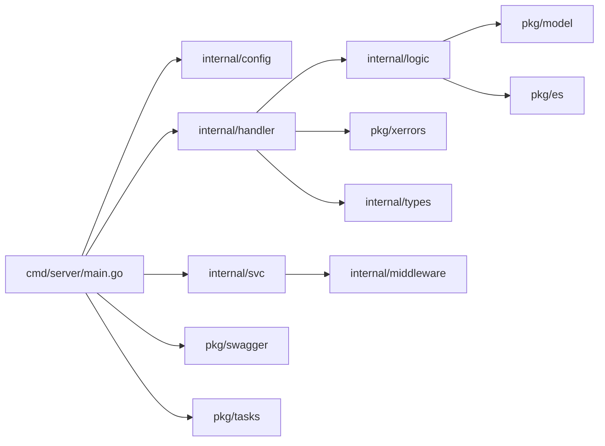

# HanYun

[中文](README.md) | English

## Project Overview

`HanYun` is a production-grade Go web framework deeply encapsulated based on go-zero. It provides a "clearly layered, easy to extend, and production-ready" backend infrastructure for rapid development of enterprise-level backend services. Its core value lies in out-of-the-box standard architecture, unified error handling and logging management, comprehensive utility library support. It is suitable for backend management systems, API service scaffolding, business systems requiring rapid iteration, and more.

## Core Features

- **Layered Architecture**: Clear `cmd/server` entry point, `internal` private layer (config/middleware/handler/logic/types/context), `pkg` public layer (components and utility libraries)
- **REST API**: Uses go-zero `rest` server with route prefixes; example interfaces have complete Handler->Logic flow
- **Unified Error Handling**: `pkg/xerrors` maps business error codes to HTTP status codes with standardized response bodies
- **Request Context Preprocessing**: `internal/middleware/prehandlemiddleware.go` automatically injects `X-Origin` / `X-Request-Id` / `X-Real-Ip`
- **Scheduled Task Support**: `pkg/tasks` based on `robfig/cron` supports second-level Cron expressions and periodic tasks
- **Swagger UI**: `pkg/swagger` provides online API documentation and testing with embedded resources
- **Comprehensive Utility Library**: Common encapsulations for encryption/encoding/HTTP/JSON/time/context (AES/SM2/SM3/RSA, etc.)
- **Containerized Deployment**: Provides standard Dockerfile and docker-compose.yml for Docker containerized deployment
- **Local Development Support**: Supports hot reload and debug mode for improved development efficiency

## Project Structure

```text
x-HanYun/
├── apis/                          # goctl API contracts (*.api)
│   ├── base.api                   # base contract (example)
│   ├── main.api                   # main contract (example)
│   ├── adminuser.api             # admin user contract
│   └── oplog.api                 # operation log contract
├── cmd/server/
│   └── main.go                   # service entry: load `config.yaml`, init config/logger/swagger/routes, start cron + HTTP server
├── internal/
│   ├── config/
│   │   └── config.go             # config file loading (config.yaml)
│   ├── handler/
│   │   ├── routes.go            # routes: /v1/api/adminser/create, /v1/api/oplog/create
│   │   ├── adminuser/
│   │   │   └── createadminuserhandler.go
│   │   └── oplog/
│   │       └── createoploghandler.go
│   ├── logic/
│   │   ├── adminuser/
│   │   │   └── createadminuserlogic.go   # business logic placeholder (TODO)
│   │   └── oplog/
│   │       └── createoploglogic.go       # business logic placeholder (TODO)
│   ├── middleware/
│   │   └── prehandlemiddleware.go        # X-Origin/ReqId/RealIP injection
│   ├── svc/
│   │   └── servicecontext.go            # ServiceContext: shared config + middleware
│   └── types/
│       └── types.go                   # request/response types (generated by goctl)
├── pkg/
│   ├── core/log/                    # zap logging + lumberjack log rotation
│   ├── swagger/                    # Swagger UI routes + embedded swagger resources
│   ├── tasks/                      # cron scheduled and periodic jobs
│   ├── xerrors/                    # error codes + HTTP mapping (unified HTTP error handler)
│   ├── model/                      # MySQL data access skeleton (initialization placeholder)
│   ├── es/                         # Elasticsearch client (optional)
│   ├── utils/                      # utility library (encryption/HTTP/JSON/time/context...)
│   ├── event/                      # event handling (placeholder)
│   ├── message/                    # message handling (placeholder)
│   └── constants/                 # constants + public types
├── scripts/
│   └── main.sql                   # MySQL DDL: `tb_op_log`
├── .air.toml                      # Air hot reload configuration
├── Dockerfile                     # Docker build file
├── docker-compose.yml             # Docker Compose orchestration file
└── LICENSE                        # MIT License
```

## System Architecture

### Layered Architecture Diagram

```mermaid
flowchart TB
  C[Client Request] --> H[internal/handler/* Handlers]
  H --> L[internal/logic/* Logic]
  H --> M[internal/middleware/prehandlemiddleware.go]
  H --> X[pkg/xerrors (Unified Error Handler)]
  L --> DB[pkg/model (MySQL, optional)]
  L --> ES[pkg/es (Elasticsearch, optional)]

  E[cmd/server/main.go (Entry)] --> CFG[internal/config (config.yaml -> Config/Logger)]
  E --> SW[pkg/swagger (Swagger UI routes)]
  E --> SCH[pkg/tasks (Scheduled/Periodic jobs)]
  E --> R[rest.Server Start]

  subgraph Internal["internal (Private Layer)"]
    M
    H
    L
  end

  subgraph Public["pkg (Public Layer)"]
    X
    DB
    ES
    SW
    SCH
  end
```

### Core Business Flow Diagram

```mermaid
flowchart LR
  A[HTTP Client] --> B[REST Route\nPOST /v1/api/adminser/create or /v1/api/oplog/create]
  B --> C[PreHandleMiddleware\ninject X-Origin/ReqId/RealIP]
  C --> D[httpx.Parse\nJSON -> Request DTO]
  D --> E[Handler\ncreate Logic -> call business method]
  E --> F[Logic Layer\n(TODO placeholder; optionally connect MySQL/ES)]
  F --> G[Response JSON]
  G --> H[httpx.OkJsonCtx]
  E -.->|error| Z[HTTPErrorHandler\nstandardized error response]
```

### Module Dependency Diagram



## Quick Start

### Requirements

#### Windows

- **Go**: `1.21+` (see `go.mod`)
- **MySQL**: `8.0+` (optional)
- **Elasticsearch**: `8.x` (optional)
- **Docker**: optional (only for containerized deployment)
- **Air**: optional (for hot reload, `go install github.com/cosmtrek/air@latest`)

#### Linux

- **Go**: `1.21+` (see `go.mod`)
- **MySQL**: `8.0+` (optional)
- **Elasticsearch**: `8.x` (optional)
- **Docker**: optional (only for containerized deployment)
- **Air**: optional (for hot reload, `go install github.com/cosmtrek/air@latest`)

### Clone the Project

```bash
git clone https://github.com/cross-lang/x-HanYun.git
cd x-HanYun
```

### Install Dependencies

```bash
go mod tidy
```

### Configuration File

This project loads the root `config.yaml` at runtime via `config.MustLoad()` from `cmd/server/main.go`.

1. Copy the example configuration file:

   ```bash
   cp config.yaml.example config.yaml
   ```

2. Edit `config.yaml` and adjust for your environment:
   - `Name`: application name
   - `Host`: listen address (default: `0.0.0.0`)
   - `Port`: listen port (default: `8888`)
   - `MySQLDSN`: MySQL database connection string (optional)
   - `ESConf`: Elasticsearch configuration (optional)
   - `Logger`: logging configuration (directory, level, remote push, etc.)

### Start the Service

#### Option 1: Local Development Mode (with hot reload and debug support)

**Normal start:**

```bash
go run ./cmd/server
```

**Build and run:**

```bash
go build -o bin/server ./cmd/server && ./bin/server
```

**Hot reload development mode:**

```bash
# Install air first time
go install github.com/cosmtrek/air@latest

# Start hot reload
air
```

In this mode, code changes will automatically trigger recompilation and service restart.

**Debug mode:**

```bash
# Install dlv first time
go install github.com/go-delve/delve/cmd/dlv@latest

# Start debug
dlv debug --headless --listen=:2345 --api-version=2 --accept-multiclient ./cmd/server
```

This mode enables the Delve debugger for breakpoint debugging in your IDE.

Service & Documentation:
- Service: `http://localhost:8888`
- Swagger UI: `http://localhost:8888/swagger/`
- Example endpoints:
  - `POST /v1/api/adminser/create`
  - `POST /v1/api/oplog/create`

#### Option 2: Docker Containerized Deployment

**Build Docker image:**

```bash
docker build -t x-hanyun:local .
```

**Start with Docker Compose:**

```bash
docker-compose up -d
```

Docker Compose includes the following services:
- `app`: x-HanYun application service
- `mysql`: MySQL 8.0 database (optional)
- `elasticsearch`: Elasticsearch 8.x (optional)

**View logs:**

```bash
docker-compose logs -f
```

**Stop services:**

```bash
docker-compose down
```

**Run container standalone:**

```bash
docker run --rm -p 8888:8888 --env-file .env x-hanyun:local
```

### Common Commands

```bash
# Run project
go run ./cmd/server

# Build project
go build -o bin/server ./cmd/server

# Hot reload development
air

# Debug mode
dlv debug --headless --listen=:2345 --api-version=2 --accept-multiclient ./cmd/server

# Run tests
go test -v ./...

# Format code
go fmt ./...

# Code check
go vet ./...

# Tidy dependencies
go mod tidy

# Docker operations
docker build -t x-hanyun:local .   # Build Docker image
docker-compose up -d                # Start Docker Compose
docker-compose down                  # Stop Docker Compose
docker-compose logs -f               # View Docker logs
```

## Tech Stack

- **Web Framework**: GoZero (`rest`/`httpx`)
- **API Contracts**: goctl (`apis/*.api` -> `internal/types`)
- **Data Storage**: MySQL (go-zero sqlx; optional)
- **Search Engine**: Elasticsearch (optional)
- **Error Handling**: custom `pkg/xerrors` (error code -> HTTP mapping)
- **Logging**: zap + lumberjack (file rotation)
- **Utilities**: crypto helpers (AES/SM2/SM3/RSA, etc.) + HTTP/JSON/time/context
- **Scheduling**: robfig/cron (second-level Cron)
- **Documentation**: Swagger UI (embedded resources)
- **Development Tools**: Air (hot reload), Delve (debugging)
- **Deployment Tools**: Docker, Docker Compose

## API Documentation

- **Swagger UI (Interactive)**: `http://localhost:8888/swagger/`
- **ReDoc (Read-only)**: Not configured yet
- **OpenAPI JSON**: `http://localhost:8888/swagger/doc.json`
- **OpenAPI YAML**: `http://localhost:8888/swagger/doc.yaml`

## Storage Configuration

### Local Storage

- Log files: `./logs/` directory
- Supports log file rotation and compression

### Object Storage

- Current version does not integrate object storage
- Extension interfaces are reserved for easy integration with Alibaba Cloud OSS, Tencent Cloud COS, etc.

## License

[MIT License](LICENSE)

## References

- [GoZero Official Documentation](https://go-zero.dev/)
- [Go Official Documentation](https://go.dev/doc/)
- [Docker Documentation](https://docs.docker.com/)
- [robfig/cron(v3)](https://pkg.go.dev/github.com/robfig/cron/v3)
- [Swagger/OpenAPI](https://swagger.io/specification/)
- [Air Hot Reload](https://github.com/cosmtrek/air)
- [Delve Debugger](https://github.com/go-delve/delve)

## Contact

- **Author**: John Young (YeYuShiLai)
- **Email**: john.young@foxmail.com
- **Gitee**: https://gitee.com/yeyushilai
- **GitHub**: https://github.com/yeyushilai
- **Project**: https://github.com/cross-lang/x-HanYun
