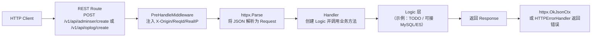
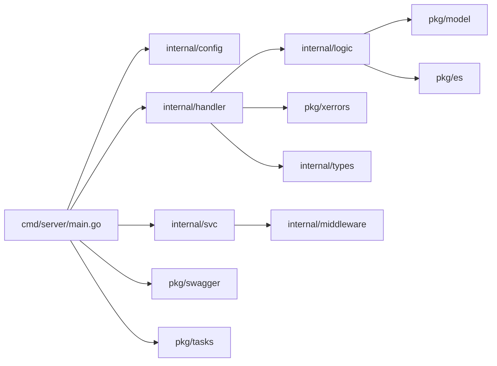

# 汉云（HanYun）

[English](README.en.md) | 中文

## 项目简介

`汉云（HanYun）`是一个基于 go-zero 框架深度封装的生产级 Go Web 项目框架。它提供"分层清晰、易扩展、可直接落地"的后端基础架构，适合快速构建企业级后端服务。核心价值在于开箱即用的标准架构、统一的错误处理和日志管理、完善的工具库支持，适用于后台管理系统、API 服务脚手架、需要快速迭代的业务系统等场景。

## 核心特征

- **分层架构**：清晰的 `cmd/server` 入口、`internal` 私有层（配置/中间件/Handler/Logic/类型/上下文）、`pkg` 公共层（组件与工具库）
- **REST API**：使用 go-zero `rest` 服务器与路由前缀，示例接口已打通 Handler->Logic 完整流程
- **统一错误处理**：`pkg/xerrors` 将业务错误码映射到 HTTP 状态码并返回标准化响应体
- **请求上下文预处理**：`internal/middleware/prehandlemiddleware.go` 自动注入 `X-Origin` / `X-Request-Id` / `X-Real-Ip`
- **定时任务能力**：`pkg/tasks` 基于 `robfig/cron` 支持秒级 Cron 表达式和周期任务
- **Swagger UI**：`pkg/swagger` 以嵌入式资源方式提供在线 API 文档与接口测试
- **工具库完善**：加密/编码/HTTP/JSON/时间/上下文等常用封装（AES/SM2/SM3/RSA 等）
- **容器化部署**：提供标准 Dockerfile 和 docker-compose.yml，支持 Docker 容器化部署
- **本地开发支持**：支持热重载和调试模式，提升开发效率

## 项目结构

```text
x-HanYun/
├── apis/                          # goctl API 契约（*.api）
│   ├── base.api                   # 基础契约（示例）
│   ├── main.api                   # 主契约（示例）
│   ├── adminuser.api             # 管理员用户契约
│   └── oplog.api                 # 操作日志契约
├── cmd/server/
│   └── main.go                   # 服务入口：加载 `config.yaml`、初始化配置/日志、注册路由与 Swagger、启动定时任务与 HTTP 服务
├── internal/
│   ├── config/
│   │   └── config.go             # 配置文件读取（config.yaml）
│   ├── handler/
│   │   ├── routes.go            # 路由注册（/v1/api/adminser/create、/v1/api/oplog/create）
│   │   ├── adminuser/
│   │   │   └── createadminuserhandler.go  # 创建管理员用户接口 Handler
│   │   └── oplog/
│   │       └── createoploghandler.go      # 创建操作日志接口 Handler
│   ├── logic/
│   │   ├── adminuser/
│   │   │   └── createadminuserlogic.go    # 业务逻辑层（当前示例 TODO）
│   │   └── oplog/
│   │       └── createoploglogic.go        # 业务逻辑层（当前示例 TODO）
│   ├── middleware/
│   │   └── prehandlemiddleware.go  # 请求预处理：X-Origin/ReqId/RealIP 注入到上下文
│   ├── svc/
│   │   └── servicecontext.go    # `ServiceContext`：共享配置与中间件
│   └── types/
│       └── types.go             # 请求/响应结构体（由 goctl 生成）
├── pkg/
│   ├── core/log/                # zap 日志 + lumberjack 文件轮转
│   ├── swagger/                # Swagger UI 路由与嵌入资源（swagger.json/yaml）
│   ├── tasks/                  # robfig/cron 定时与周期任务
│   ├── xerrors/                # 错误码定义与 HTTP 映射（统一错误处理）
│   ├── model/                  # MySQL 数据访问骨架（当前示例仅提供初始化）
│   ├── es/                     # Elasticsearch 客户端（在 main.go 中为可选）
│   ├── utils/                  # 工具库：AES/RSA/SM2/SM3/HTTP/JSON/时间/上下文等
│   ├── event/                  # 事件处理（预留）
│   ├── message/                # 消息处理（预留）
│   └── constants/             # 常量与公共类型
├── scripts/
│   └── main.sql                 # MySQL 表结构脚本（`tb_op_log`）
├── .air.toml                     # Air 热重载配置
├── Dockerfile                    # Docker 构建文件
├── docker-compose.yml            # Docker Compose 编排文件
└── LICENSE                       # MIT 许可证
```

## 系统架构

### 系统分层架构图

```mermaid
flowchart TB
  C[Client Request] --> H[internal/handler/* Handler]
  H --> L[internal/logic/* Logic]
  H --> E[internal/middleware/prehandlemiddleware.go]
  H --> R[pkg/xerrors (统一错误处理)]
  L --> DB[pkg/model (MySQL, 可选)]
  L --> ES[pkg/es (Elasticsearch, 可选)]

  M[cmd/server/main.go (Entry)] --> CFG[internal/config (config.yaml -> Config/Logger)]
  M --> SW[pkg/swagger (Swagger UI routes)]
  M --> SCH[pkg/tasks (Scheduled/Periodic)]
  M --> S[rest.Server Start]

  subgraph Internal["internal（私有层）"]
    E
    H
    L
  end

  subgraph Public["pkg（公共层）"]
    R
    DB
    ES
    SW
    SCH
  end
```

### 核心功能业务流程图



### 模块依赖关系图



## 快速开始

### 环境要求

#### Windows
- **Go**：`1.21+`（见 `go.mod`）
- **MySQL**：`8.0+`（可选）
- **Elasticsearch**：`8.x`（可选）
- **Docker**：可选（仅用于容器启动）
- **Air**：可选（用于热重载，`go install github.com/cosmtrek/air@latest`）

#### Linux
- **Go**：`1.21+`（见 `go.mod`）
- **MySQL**：`8.0+`（可选）
- **Elasticsearch**：`8.x`（可选）
- **Docker**：可选（仅用于容器启动）
- **Air**：可选（用于热重载，`go install github.com/cosmtrek/air@latest`）

### 项目克隆

```bash
git clone https://gitee.com/yeyushilai/x-HanYun.git
cd x-HanYun
```

### 依赖安装

```bash
go mod tidy
```

### 配置文件创建

本项目在 `cmd/server/main.go` 中通过 `config.MustLoad()` 加载根目录 `config.yaml`。

1. 复制示例配置文件：

   ```bash
   cp config.yaml.example config.yaml
   ```

2. 编辑 `config.yaml`，根据实际环境修改配置：
   - `Name`：应用名称
   - `Host`：监听地址（默认 `0.0.0.0`）
   - `Port`：监听端口（默认 `8888`）
   - `MySQLDSN`：MySQL 数据库连接串（可选）
   - `ESConf`：Elasticsearch 配置（可选）
   - `Logger`：日志配置（目录、级别、远程推送等）

### 服务启动

#### 方式一：本地开发模式启动（支持热重载、调试模式）

**普通启动：**
```bash
go run ./cmd/server
```

**编译后启动：**
```bash
go build -o bin/server ./cmd/server && ./bin/server
```

**热重载开发模式：**
```bash
# 首次使用需要安装 air
go install github.com/cosmtrek/air@latest

# 启动热重载
air
```
此模式下代码修改会自动重新编译并重启服务。

**调试模式：**
```bash
# 首次使用需要安装 dlv
go install github.com/go-delve/delve/cmd/dlv@latest

# 启动调试
dlv debug --headless --listen=:2345 --api-version=2 --accept-multiclient ./cmd/server
```
此模式启用 Delve 调试器，可在 IDE 中进行断点调试。

服务与文档：
- 服务：`http://localhost:8888`
- Swagger：`http://localhost:8888/swagger/`
- Postman：导入 `pkg/swagger/x-HanYun.postman_collection.json`，然后按需修改 Collection 变量 `baseUrl`
- 示例接口：
  - `POST /v1/api/adminser/create`
  - `POST /v1/api/oplog/create`

#### 方式二：Docker 容器化部署

**构建 Docker 镜像：**
```bash
docker build -t x-hanyun:local .
```

**使用 Docker Compose 启动：**
```bash
docker-compose up -d
```

Docker Compose 包含以下服务：
- `app`：x-HanYun 应用服务
- `mysql`：MySQL 8.0 数据库（可选）
- `elasticsearch`：Elasticsearch 8.x（可选）

**查看日志：**
```bash
docker-compose logs -f
```

**停止服务：**
```bash
docker-compose down
```

**单独运行容器：**
```bash
docker run --rm -p 8888:8888 --env-file .env x-hanyun:local
```

### 常用命令

```bash
# 运行项目
go run ./cmd/server

# 编译项目
go build -o bin/server ./cmd/server

# 热重载开发
air

# 调试模式
dlv debug --headless --listen=:2345 --api-version=2 --accept-multiclient ./cmd/server

# 运行测试
go test -v ./...

# 代码格式化
go fmt ./...

# 代码检查
go vet ./...

# 依赖整理
go mod tidy

# Docker 操作
docker build -t x-hanyun:local .   # 构建 Docker 镜像
docker-compose up -d                # 启动 Docker Compose
docker-compose down                  # 停止 Docker Compose
docker-compose logs -f               # 查看 Docker 日志
```

## 技术栈

- **Web 框架**：GoZero（`rest`/`httpx`）
- **API 契约**：goctl（`apis/*.api` -> `internal/types`）
- **数据存储**：MySQL（go-zero sqlx，当前为可选启用）
- **搜索引擎**：Elasticsearch（可选启用）
- **错误处理**：自定义 `pkg/xerrors`（错误码 -> HTTP 映射）
- **日志**：zap + lumberjack（文件轮转）
- **工具库**：crypto（AES 等）/ tjfoc-gmsm（SM2/SM3）/ HTTP/JSON/时间等
- **任务调度**：robfig/cron（秒级 Cron）
- **文档**：Swagger UI（嵌入式资源）
- **开发工具**：Air（热重载）、Delve（调试）
- **部署工具**：Docker、Docker Compose

## API 文档

- **Swagger UI（交互式）**：`http://localhost:8888/swagger/`
- **ReDoc（只读）**：暂未配置
- **OpenAPI JSON**：`http://localhost:8888/swagger/doc.json`
- **OpenAPI YAML**：`http://localhost:8888/swagger/doc.yaml`

## 存储配置

### 本地存储
- 日志文件：`./logs/` 目录
- 支持日志文件轮转和压缩

### 对象存储
- 当前版本暂未集成对象存储
- 预留扩展接口，可轻松集成阿里云 OSS、腾讯云 COS 等

## 许可证

[MIT License](LICENSE)

## 参考资料

- [GoZero 官方文档](https://go-zero.dev/)
- [Go 官方文档](https://go.dev/doc/)
- [Docker 文档](https://docs.docker.com/)
- [robfig/cron(v3)](https://pkg.go.dev/github.com/robfig/cron/v3)
- [Swagger/OpenAPI](https://swagger.io/specification/)
- [Air 热重载](https://github.com/cosmtrek/air)
- [Delve 调试器](https://github.com/go-delve/delve)

## 联系方式

- **作者**：John Young（夜雨诗来）
- **邮箱**：john.young@foxmail.com
- **Gitee 地址**：https://gitee.com/yeyushilai
- **GitHub 地址**：https://github.com/yeyushilai
- **项目地址**：https://gitee.com/yeyushilai/x-HanYun
